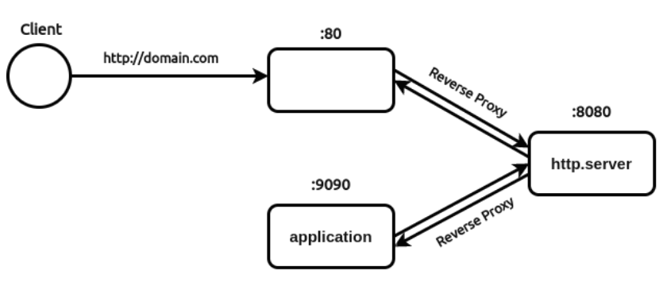

# AI based WAF (Web application Firewall) - GradSecure
This project is commited to the idea of providing security for web developers, by preventing from SQL injections and XSS attacks.

The system uses AI based ML model called RandomForest, with 2Gram CountVectorizer, sklearn models are used to make the overall processe possible. You can also find out the datasets on /vendor/discriminator/data directory. 
However if you are not interested in ML part the trained model is already stored in /vendor/discriminator/finalized_model.sav file you can just load it.
You can also find some test(dummy) webapps stored in /web_apps directory, there are web apps writen in: Python(Flask), PHP(Vanila, WP, Laravel) ... 

## Overall Schema



## Prerequisite

>  OS: Linux (tested on Deb and Kali)
  Programming Languages: Python3.6.0 >=
    Python packages: http.server, requests, pickle, pandas, json, sklearn
  WebApp: Any webapp writen in PHP, NodeJS, Python, Ruby etc. 

## Configurations and setup for details

1. Download the directory (or clone it) and unzip it anywhere you want, best possible directory can be /var/www/grad_secure
2. Open grad_secure/config.json and set your configurarions: gradsecurity - where the WAF should be running, webapp - where your web application is running, for example 

```
{
    "gradsecurity": {
        "protocol": "http",
        "host": "127.0.0.1",
        "port": "8085"
    },
    "webapp": {
        "protocol": "http",
        "host": "127.0.0.1",
        "port": "9090"
    },
    "score_restrictions": {
        "gray_client_score_max": 3,
        "black_client_score_max": 5,
        "days_to_unblock": 20
    }
}
```

3. Open your web provider service configurations and configure it as required bellow:
   3.1 For Apache2 open, /etc/apache2/000-default.conf , it should be hosting :80 port (if not make sure it does), copy and paste the following lines before </VirtualHost> closing tag, where xxxx is the port on which grad_secure should be running (use the same port you put on step 2), the second line is used to prevent reverse proxy on the metnioned directory
   
   ```
        ProxyPreserveHost On
        
        ProxyPass /xxxx/ !
        ProxyPass / http://127.0.0.1:xxxx/
        ProxyPassReverse / http://127.0.0.1:xxxx/
   ```
   
   for our example the following should be used
   ```
        ProxyPreserveHost On
        
        ProxyPass /phpmyadmin/ !
        ProxyPass / http://127.0.0.1:8055/
        ProxyPassReverse / http://127.0.0.1:8055/
   ```      
   3.2 For Nginx open, /etc/nginx/sites-available/default , it should be hosting :80 port (if not make sure it does), copy and paste the following lines before "server" s closing currly braces, where xxxx is the port on which grad_secure should be running (use the same port you put on step 2)
   ```
        location / {
            proxy_pass http://localhost:xxxx/;
        }
   ```     
   for our example the following should be used
   ```
        location / {
            proxy_pass http://localhost:8055/;
        }
   ```       
4. Run the following commands on terminal to activate proxy service, and restart to make changes take place.
  ```
  sudo a2enmod proxy
  sudo a2enmod proxy_http
  
  systemctl restart apache2
  ```
5. Run the following commands to install python3 requirements
  ```
  sudo chmod +x requirements.txt
  ./requirements.txt
  ```
6. Run grad_secure, by opening terminal in the corresponding location and typing
  ```
  sudo python3 main.py
  ```
7. Run your WebApp on the port you specified on the config.json file
